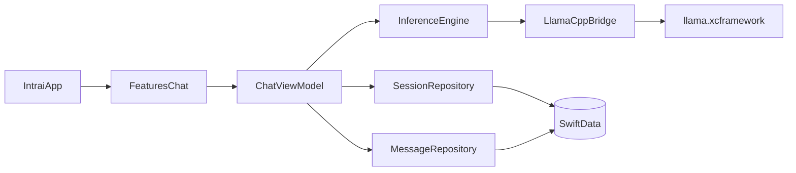

# Intrai MVP Architecture

## Architecture Overview

Intrai v1 uses an embedded `llama.cpp` runtime through `llama.xcframework`.
The app keeps inference in-process and persists all user data on-device with SwiftData.

## Module Boundaries

- `App`
  - App entry point, model container bootstrap, root navigation.
- `Features/Chat`
  - Session list UI, thread UI, composer interactions, and view models.
- `Data`
  - SwiftData entities and repository implementations.
- `Inference`
  - Swift wrappers around `llama.cpp` C API and streaming/cancellation control.
- `Shared`
  - Common types, domain errors, and utility extensions.

## Protocol Contracts (MVP)

Domain models use a two-type pattern: SwiftData entities (`ChatSessionEntity`,
`ChatMessageEntity`) map to lightweight value-type records (`ChatSessionRecord`,
`ChatMessageRecord`) at the repository boundary.

### SessionRepository

- `createSession(title: String?) async throws -> ChatSessionRecord`
- `renameSession(id: UUID, title: String) async throws`
- `deleteSession(id: UUID) async throws`
- `listSessions() async throws -> [ChatSessionRecord]`

### MessageRepository

- `appendUserMessage(sessionID: UUID, content: String) async throws -> ChatMessageRecord`
- `appendAssistantPlaceholder(sessionID: UUID) async throws -> ChatMessageRecord`
- `appendAssistantChunk(messageID: UUID, chunk: String) async throws`
- `markMessageFailed(messageID: UUID, reason: String) async throws`
- `markMessageCancelled(messageID: UUID) async throws`
- `markMessageComplete(messageID: UUID) async throws`
- `listMessages(sessionID: UUID) async throws -> [ChatMessageRecord]`

### InferenceEngine (`nonisolated`, `Sendable`)

- `loadModel(from modelURL: URL) async throws`
- `unloadModel() async`
- `generateStream(prompt: String, options: GenerationOptions) async -> AsyncThrowingStream<String, Error>`
- `cancelGeneration() async`

### MetricsRecorder (`nonisolated`, `Sendable`)

- `recordGeneration(_ metrics: GenerationMetrics) async`

## Error Domains

All errors use a single `IntraiError` enum:

- `.modelNotLoaded` - inference attempted without a loaded model.
- `.modelLoadFailed(reason:)` - file not found, invalid gguf, context creation failure.
- `.generationFailed(reason:)` - runtime failure or stream interruption.
- `.persistenceFailed(reason:)` - write/read failures in SwiftData operations.

All cases surface user-friendly messages through `ChatViewModel`.

## XCFramework Integration Workflow (MVP)

1. Build framework from local clone:
   - Repo: `~/Local Documents/repos/llama.cpp`
   - Command: `./scripts/setup-llama-xcframework.sh` (from Intrai repo root)
2. Locate build artifact:
   - `vendor/llama/llama.xcframework` (gitignored; regenerated by the script)
3. Framework reference is already wired in the Xcode project file
   (PBXBuildFile + Frameworks build phase + `-lc++` linker flag).
4. Swift bridge in `Inference` layer isolates direct C symbol usage:
   - `LlamaCppBridge` protocol (nonisolated, Sendable)
   - `LlamaCppRuntime` concrete implementation with `#if canImport(llama)` guard
   - `LlamaCppInferenceEngine` actor that serializes access to the bridge
5. Validate at runtime:
   - model load success
   - token stream begins
   - cancellation path releases resources

### MVP Targeting Constraint

- Build and package only iOS slices (device + simulator).
- Do not include macOS, visionOS, or tvOS slices in MVP framework artifacts.

## Swift 6 Concurrency Strategy

The project targets Xcode 26 with `SWIFT_DEFAULT_ACTOR_ISOLATION = MainActor` and
all Swift upcoming features enabled (Swift 5 language mode, preparing for Swift 6).

- **UI layer** (`ChatViewModel`, views, repositories): MainActor-isolated by default.
  `ChatViewModel` uses the `@Observable` macro (not `ObservableObject`).
- **Inference layer** (`InferenceEngine`, `LlamaCppBridge`): `nonisolated` protocols
  with `Sendable` conformance. `LlamaCppInferenceEngine` is an explicit `actor` that
  serializes access to the C bridge. `LlamaCppRuntime` is `nonisolated @unchecked Sendable`.
- **Metrics**: `MetricsRecorder` protocol is `nonisolated Sendable` with `async` methods.

## Non-Goals for v1 Architecture

- Multi-process local server architecture.
- Pluggable cloud fallback backends.
- Background inference orchestration across multiple sessions.
