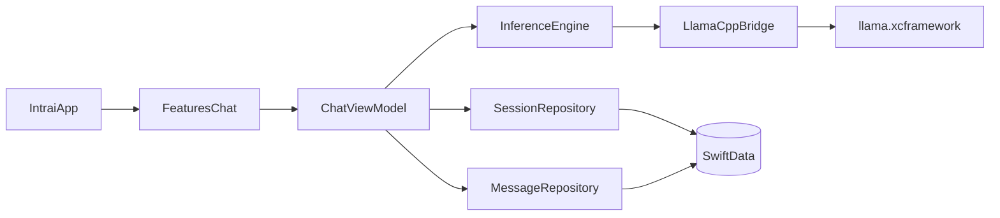

# Intrai MVP Architecture

## Architecture Overview

Intrai v1 uses an embedded `llama.cpp` runtime through `llama.xcframework`.
The app keeps inference in-process and persists all user data on-device with SwiftData.

## Module Boundaries

- `App`
  - App entry point, model container bootstrap, root navigation.
- `Features/Chat`
  - Session list UI, thread UI, composer interactions, and view models.
- `Data`
  - SwiftData entities and repository implementations.
- `Inference`
  - Swift wrappers around `llama.cpp` C API and streaming/cancellation control.
- `Shared`
  - Common types, domain errors, and utility extensions.

## Protocol Contracts (MVP)

### Session Repository

- `createSession(title: String?) async throws -> ChatSession`
- `renameSession(id: UUID, title: String) async throws`
- `deleteSession(id: UUID) async throws`
- `listSessions() async throws -> [ChatSession]`

### Message Repository

- `appendUserMessage(sessionId: UUID, content: String) async throws -> ChatMessage`
- `appendAssistantPlaceholder(sessionId: UUID) async throws -> ChatMessage`
- `appendAssistantChunk(messageId: UUID, chunk: String) async throws`
- `markMessageFailed(messageId: UUID, reason: String) async throws`
- `listMessages(sessionId: UUID) async throws -> [ChatMessage]`

### Inference Engine

- `loadModel(from modelURL: URL) async throws`
- `unloadModel() async`
- `generateStream(prompt: String, options: GenerationOptions) -> AsyncThrowingStream<String, Error>`
- `cancelGeneration() async`

## Error Domains

- `ModelLoadError`
  - file not found, invalid gguf, unsupported model configuration.
- `GenerationError`
  - runtime failure, stream interruption, cancelled.
- `PersistenceError`
  - write/read failures in SwiftData operations.

All error domains must map to user-friendly messages in `Features/Chat`.

## XCFramework Integration Workflow (MVP)

1. Build framework from local clone:
   - Repo: `~/Local Documents/repos/llama.cpp`
   - Command: `./build-xcframework.sh`
2. Locate build artifact:
   - `~/Local Documents/repos/llama.cpp/build-apple/llama.xcframework`
3. Add framework to Intrai target:
   - `Frameworks, Libraries, and Embedded Content`.
4. Add thin Swift bridge in `Inference` layer:
   - isolate direct C symbol usage to bridge files.
5. Validate at runtime:
   - model load success
   - token stream begins
   - cancellation path releases resources

## Non-Goals for v1 Architecture

- Multi-process local server architecture.
- Pluggable cloud fallback backends.
- Background inference orchestration across multiple sessions.
